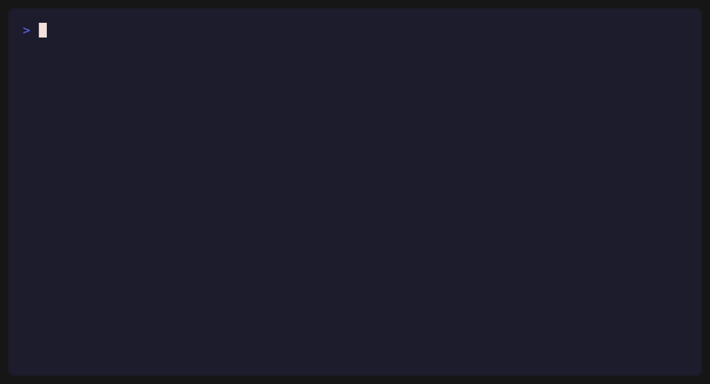

# DProvenanceKit (Python)

[](https://github.com/Therealdk8890/DProvenanceKitPython/actions/workflows/ci.yml)
[](https://pypi.org/project/dprovenancekit/)
**Regression testing and reasoning observability for AI agents — catch the run where your agent
silently dropped a step, and fail the PR that caused it.**

When an agent's reasoning drifts between runs, DProvenanceKit turns each execution into a queryable,
diffable trace so you can see *what changed and why* — not just *what happened*. It works with
LangChain/LangGraph, the OpenAI Agents SDK, LlamaIndex, CrewAI, or plain Python, and the core has
zero third-party dependencies.

> Run → Record → Query → Diff → Detect regressions → Gate in CI

<p align="center">
  
</p>

<p align="center"><em>Two runs of the same agent. The candidate dropped its <code>verify</code> step and looped <code>search</code> — the gate caught it and failed CI. <a href="demo/demo_gif.py">(regenerate)</a></em></p>

**It's not just the library** — it ships the surfaces that make reasoning regressions actionable:

- **Gate in CI** — a server-less `dprovenancekit gate` CLI, plus a drop-in [GitHub Action](action/README.md) ([on the GitHub Marketplace](https://github.com/marketplace/actions/dprovenancekit-regression-gate)) and [GitLab CI template](gitlab/README.md) that fail a PR/MR when an agent's reasoning drifts from a golden baseline, and comment the diff.
- **Out-of-the-box anomaly rules** — Tool Drop and Looping detection with a JSON rule registry, runnable locally or on every PR.
- **A hosted visualizer** — a web dashboard (single-run span tree, JSON payload inspector, side-by-side semantic diff, shareable HTML reports) backed by a regression-gate API and multi-tenant control plane. Available as a separate commercial service.

See it all in one runnable script: [`python
examples/end_to_end_demo.py`](examples/end_to_end_demo.py).

---

## Install

From PyPI (released builds):

```bash
pip install dprovenancekit
pip install "dprovenancekit[langchain]"        # + LangChain adapter
pip install "dprovenancekit[openai-agents]"    # + OpenAI Agents adapter
```

From a checkout (development):

```bash
pip install -e ".[dev]"
```

Requires Python 3.9+; the core has **zero third-party dependencies**. Releasing is documented
in [RELEASING.md](RELEASING.md).

---

## The 5-Minute "Wow"

Record your execution, explain what happened, and diff it against a previous run to detect drift—all
with a single import.

```python
from dprovenancekit import trace

# 1. Record an execution
with trace("Agent Workflow"):
    with trace("Retrieve Documents"):
        # your retrieval code here
        pass
    with trace("Verify Claims"):
        # your verification code here
        pass

# 2. Save the trace
trace.save("golden_run.sqlite")

# 3. Print a structural explanation
trace.explain()
# --- Execution Trace (b4f8d2…) ---
# ▶ Started Agent Workflow
#   ▶ Started Retrieve Documents
#   ✔ Finished Retrieve Documents
#   ▶ Started Verify Claims
#   ✔ Finished Verify Claims
# ✔ Finished Agent Workflow

# 4. Catch regressions when the logic changes: rerun the (now buggy) workflow,
#    then diff the current run against the saved golden baseline
trace.diff("golden_run.sqlite")
# --- Trace Diff (Golden vs Current) ---
# ❌ Missing step: Verify Claims
```

It’s that simple to get started. Under the hood, this powers a full suite of anomaly detection, CI
gating, and visual trace analysis.

---

## Benchmark corpus

The library ships the same validation corpus as the Swift version. The headless CLI runs it through
the real benchmark runner:

```bash
dprovenancekit evaluate     # precision/recall/F1 over the standard + adversarial corpora
dprovenancekit diagnose     # causal ranking of failure modes
dprovenancekit stability    # determinism boundary: isolated vs perturbed F1 variance
```

Both corpora score **Precision 1.000 / Recall 1.000 / F1 1.000** — 8 standard scenarios (reordering,
semantic evolution, noise injection, branch collapse, …) and 5 adversarial robustness traps
(dependency inversion, partial truncation, semantic substitution, …) — matching the Swift
implementation case-for-case.

---

## What's included

| Component | Module |
| --- | --- |
| Event model, priority tiers, drop accounting | `event`, `priority`, `drop_stats` |
| Recording API + ambient context | `kit`, `context` |
| Global `trace` facade (record / save / explain / diff) | `facade` |
| Stores (in-memory, WAL SQLite, raw read) | `store`, `sqlite_store`, `raw_store` |
| Priority-aware write buffer | `write_buffer` |
| Query DSL + two backends (AST eval + SQL compiler) | `query` |
| Live querying + anomaly detection + rule library | `live_engine`, `anomaly`, `rules` |
| Structural diff + span-aware snapshot diff | `diff`, `snapshot_diff` |
| Deterministic replay | `replay` |
| Semantic alignment engine + evidence + verification | `alignment_*`, `verification` |
| Benchmark harness, failure diagnoser, corpus | `benchmark`, `corpus` |
| Conformance testing | [`conformance/`](conformance/) (repo directory, not a package module) |
| Regression gate + fingerprinting test helpers | `testing`, `pytest_plugin` |
| Visualizer (HTML rendering) | `visualizer` |
| Local trace viewer server | `ui_server` |
| Pure view models for a trace viewer | `viewmodel` |
| Framework-agnostic instrumentation (decorators) | `instrument` |
| Framework adapters | `integrations.langchain`, `integrations.openai_agents`, `integrations.llama_index`, `integrations.crewai`, `integrations.google_genai`, `integrations.fastapi`, `integrations.jupyter`, `integrations.mcp` |
| Shareable HTML regression report | `report` |
| Headless CLI — `gate`, `anomalies`, `runs`, `evaluate` | `cli` |

The SwiftUI `DProvenanceUI` target is intentionally **not** ported (it is Apple-platform UI); its
pure value-model layer (`SpanViewModel`, flattening) is ported in `viewmodel`.

---

## The Swift original

DProvenanceKit began as a [Swift library](https://github.com/Therealdk8890/DProvenanceKit) for
Apple-platform and on-device AI. This Python implementation brings the same reasoning-layer
observability to Python codebases — agent frameworks, LLM workflows, tool-using models — with
**zero third-party dependencies** (it uses only the standard library: `sqlite3`, `contextvars`,
`threading`, `json`, `hashlib`, `uuid`, `urllib`).

It is a faithful port, not a loose reimplementation: it keeps the same architecture and guarantees —
synchronous non-blocking recording, priority-aware backpressure, one query language over two
backends held at parity, structural diffing, formally-modeled semantic alignment, and by-tier drop
accounting so load-shedding is never silent. The original Swift package is unchanged; the two are
held equivalent by the conformance suite below.

---

## Cross-language conformance

Keeping the Swift and Python SDKs behaviorally equivalent is enforced, not hoped for.
[`conformance/`](conformance/) holds **Trace Specification v1** — a language-neutral contract plus
frozen golden vectors that pin the run fingerprint, the alignment profile hash, canonical payload
encoding, query semantics, and alignment verdicts.

```bash
python -m pytest tests/test_conformance.py   # the Python SDK's claim of conformance
python conformance/generate_vectors.py        # intentionally re-freeze the contract
```

The committed `conformance/vectors/*.json` are the contract: any SDK — Swift today, Rust or
TypeScript later — proves equivalence by reproducing the same files. See
[`conformance/TRACE_SPEC_v1.md`](conformance/TRACE_SPEC_v1.md).

---

## Integrations

Framework adapters live in `dprovenancekit.integrations` and are the only parts of the package with
third-party dependencies — the core stays pure standard library, and nothing imports an adapter
unless you do.

### LangChain / LangGraph

```bash
pip install "dprovenancekit[langchain]"
```

```python
from dprovenancekit import SQLiteTraceStore
from dprovenancekit.integrations.langchain import DProvenanceTracer, LangChainTraceEvent

store = SQLiteTraceStore(LangChainTraceEvent, "traces.sqlite")
tracer = DProvenanceTracer(store)

with tracer.trace(context_id="customer-42") as cb:
    answer = chain.invoke(question, config={"callbacks": [cb]})

# The run is now recorded — query it, diff it against a known-good run, or
# compare run fingerprints to detect when the agent took a different path.
```

[`DProvenanceCallbackHandler`](dprovenancekit/integrations/langchain.py) translates LangChain's
callback stream into a trace: each `on_llm_start` / `on_tool_start` / `on_retriever_start` /
`on_chain_start` (and its completion) becomes a typed event in execution order, LangChain's
`run_id`/`parent_run_id` become the trace's **span tree**, the active model/tool/retriever becomes
the **engine**, and (by default) lifecycle **provenance edges** are emitted (`DERIVED_FROM`
start→completion, `INFORMED` parent→child). Because events flow through the same recording path as
hand-written ones, the whole toolkit applies: a run's **fingerprint** is the structural identity of
the agent's execution path, so two runs that diverge (a tool called in a different order, a
retrieval step skipped) produce different fingerprints — a cheap regression signal. Options:
`capture_payloads` (prompt/completion/IO previews), `link_lifecycle` (edges), `record_chains`
(LCEL/LangGraph chain noise).

### OpenAI Agents SDK

```bash
pip install "dprovenancekit[openai-agents]"
```

```python
from dprovenancekit import SQLiteTraceStore
from dprovenancekit.integrations.openai_agents import register, OpenAIAgentsTraceEvent

store = SQLiteTraceStore(OpenAIAgentsTraceEvent, "traces.sqlite")
register(store)   # registers a global tracing processor

# ... run your agents normally; each run is recorded ...
```

[`DProvenanceTracingProcessor`](dprovenancekit/integrations/openai_agents.py) implements the SDK's
`TracingProcessor`: each agent run becomes a trace-run (`context_id` = the trace name), and every
span start/end becomes a typed event — `agent.start`, `generation.end`, `function.start`,
`guardrail.error`, … — in execution order. The span's `span_id`/`parent_id` become the **span
tree**, the active agent/tool/model becomes the **engine**, errors and triggered guardrails are
recorded at `CRITICAL`, and lifecycle **provenance edges** are emitted (same
`DERIVED_FROM`/`INFORMED` model). One registered processor captures every run; the same
`fingerprint`/diff/align tooling then applies.

### LlamaIndex

```bash
pip install "dprovenancekit[llama-index]"
```

```python
from llama_index.core import Settings
from dprovenancekit import DProvenanceKit, SQLiteTraceStore
from dprovenancekit.integrations.llama_index import (
    DProvenanceLlamaIndexCallbackHandler,
    LlamaIndexTraceEvent,
)

kit = DProvenanceKit(LlamaIndexTraceEvent)
store = SQLiteTraceStore(LlamaIndexTraceEvent, "traces.sqlite")

# The handler records into an active run
with kit.run(context_id="qa-session", store=store) as run:
    handler = DProvenanceLlamaIndexCallbackHandler(run)
    Settings.callback_manager.add_handler(handler)

    # Execute queries normally; they are recorded to the trace store
    response = index.as_query_engine().query("What did the author do growing up?")

# Flush buffered events so the recorded run is durable before the script exits
store.flush()
```

### CrewAI

```bash
pip install "dprovenancekit[crewai]"
```

```python
from dprovenancekit import DProvenanceKit, InMemoryTraceStore
from dprovenancekit.integrations.crewai import CrewAITracer

# CrewAI runs on LangChain under the hood; the tracer is a LangChain callback
# handler that records each agent's chain start/end as typed events. Start events
# record under the agent's role (from callback metadata) as the engine name.
kit = DProvenanceKit(MyEvent)  # your TraceableEvent subclass
tracer = CrewAITracer(kit, MyEvent.agent_start, MyEvent.agent_end)

store = InMemoryTraceStore()
with kit.run(context_id="crew-run", store=store):
    # ... attach `tracer` as a LangChain callback and kick off your crew ...
    result = crew.kickoff()
```

---

## Regression gate

`dprovenancekit.testing` turns "did my agent regress?" into one assertion you can drop into any test
or CI step. Give it a *golden* run (known-good) and a *candidate* run (what your current code
produced); it aligns them and fails with a readable diagnostic if the candidate diverged.

```python
from dprovenancekit.testing import assert_no_regression

assert_no_regression(golden=golden_run, candidate=candidate_run)
```

Strict by default — any removed, added, or changed (ambiguous) step fails, and a removed *or
reordered* CRITICAL step is additionally a HIGH-severity regression (reordering a critical step can
invert a dependency). Loosen with `max_regression_level` (gate only on severity) or
`allow_divergent_steps` (tolerate benign per-step changes), or pass a custom `evaluator` to define
what "equivalent" means (e.g. ignore volatile fields like token counts).
`RegressionGate(...).check(...)` returns a `RegressionReport` (no raise) for richer assertions.
Detecting *reordered* steps requires a span-aware profile (`AlignmentProfile.developer_debug_v1`);
the default linear profile treats a pure reorder as still-matching. Complements
`AlignmentSnapshotValidator` (an exact output-hash snapshot): the gate works on two runs and reasons
about regression severity.

### Pin a golden baseline in pytest

The bundled pytest plugin turns the gate into snapshot testing for reasoning traces — no run ids,
no store plumbing:

```python
def test_research_agent(golden_trace):
    with golden_trace("research-agent"):
        run_my_agent()   # anything using @traced / record_event / an adapter
```

```bash
pytest --dprov-update-golden   # record (or intentionally update) the baseline, then commit it
pytest                         # every run after gates against tests/goldens/research-agent.sqlite
```

The baseline is a SQLite file you commit next to your tests; the fixture records the block as a
candidate run and fails the test when its reasoning drifts. Configure the directory with the
`dprov_golden_dir` ini option, pass gate options per test
(`golden_trace("name", max_regression_level="high")`), and use the context manager's `.run` to
wire a framework adapter inside the block.

---

## Example: regression testing

[`examples/regression_testing.py`](examples/regression_testing.py) is the end-to-end story in ~150
readable lines: record a **golden** run of a fact-checking agent (retrieve → verify → decide), then
catch a later run that skips its verification step — via both the fast **fingerprint** check and the
detailed **alignment** verdict (which flags the dropped `claimVerified` step as a HIGH regression).

```bash
python examples/regression_testing.py
```

It self-asserts its verdicts, so it doubles as an executable test of the headline use case.

---

## Instrumenting plain code (no framework)

Not using a framework? Instrument a hand-written agent loop directly — no event type to define, zero
dependencies (ships in core as `dprovenancekit.instrument`):

```python
from dprovenancekit import InMemoryTraceStore, traced, traced_run, record_event

@traced
def search(query): ...

@traced
def answer(question, sources): ...

store = InMemoryTraceStore()
with traced_run(store, context_id="ticket-42"):
    sources = search(question)
    record_event("plan.chosen", {"strategy": "rag"})
    reply = answer(question, sources)
```

`@traced` records a `"<name>.start"` / `".end"` / `".error"` event pair per call in its own **span**
(the function name is the **engine**), nests calls in the span tree, and emits the same
`DERIVED_FROM` / `INFORMED` provenance edges as the framework adapters. `record_event(...)` drops an
ad-hoc event (a decision, a chosen branch). Plain functions, `async def`, generators, and async
generators are all supported (for a generator, start/end bracket the full iteration).
Instrumentation never changes behavior — capture is failure-proof and exceptions pass through
unchanged. Outside a `traced_run` the decorators are transparent, so instrumented code is safe to
call untraced. The trace it produces is identical in shape to the adapter-produced ones, so
fingerprint / diff / align / the regression gate all apply.

---

## Tests

```bash
python -m pytest
```

251 tests: 80 ported from the Swift suite (query parity, write-buffer backpressure, SQLite stress +
drop accounting, alignment, replay, snapshot diff, explainability fidelity, benchmark scoring, …),
28 cross-language conformance checks against the frozen Trace Specification v1 vectors, 14 LangChain
integration tests, 16 OpenAI Agents SDK integration tests, 16 instrumentation-layer tests, 13
regression-gate tests, facade tests, ecosystem integration tests (FastAPI, Jupyter, MCP, CrewAI),
visualizer tests, and the regression-testing example run as a self-asserting test. (The
real-framework tests run only when the integrations are installed, otherwise skipped.)

---

## License

Distributed under the **Apache License 2.0**. See [LICENSE](LICENSE).

